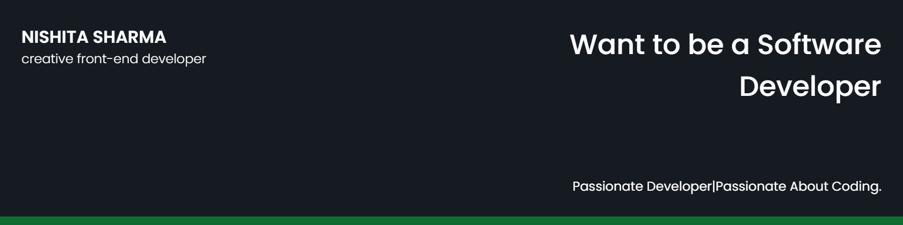

# Nishita23

## 🧔 About Me

- 🔭 I’m currently working on [CSS Art Gallery](https://github.com/Nishita23/css-art-gallery)

- 🌱 I’m currently learning **JAVA, REACT**

## ✍ My Work

Here are some of my projects on Github that I am proud of:

## 📚 My Skills

## 🤝 Connect

